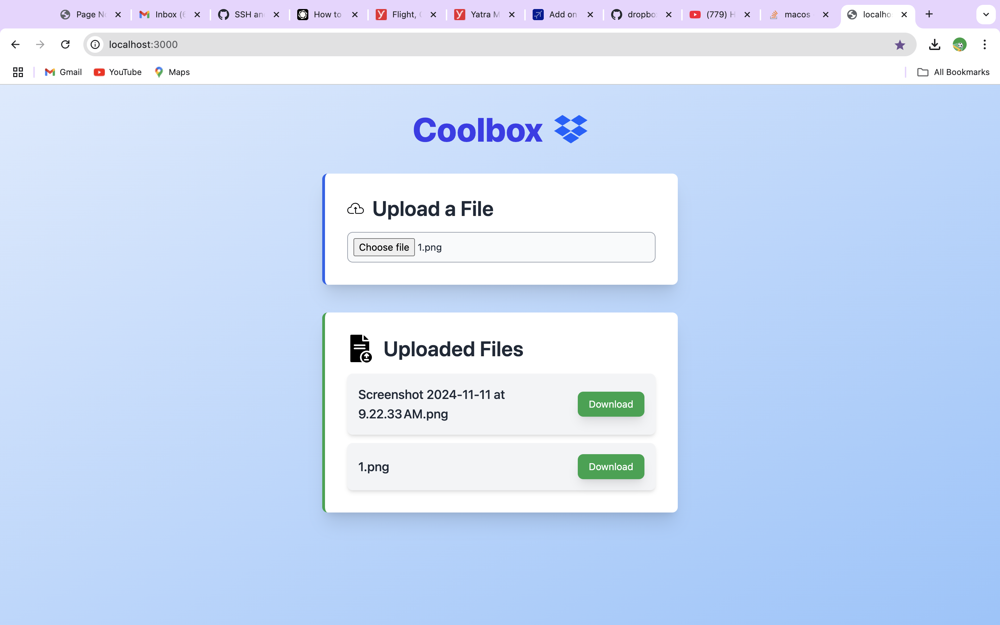
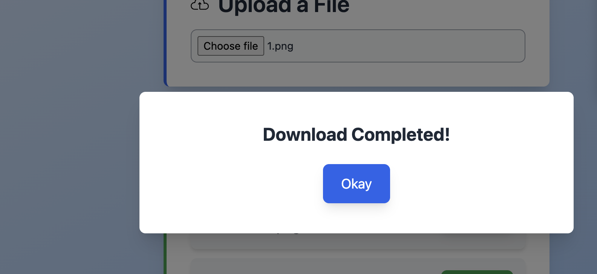

# Dropbox Clone Project

A **Dropbox-like application** built using **Spring Boot** for the backend and **React (Next.js)** with **TypeScript** for the frontend. It allows users to upload files, view the list of uploaded files, and download files with a clean and responsive UI.

---
## Features

- **File Upload**: Upload files to the server, and metadata is stored in the database.
- **File List**: View all uploaded files with their metadata (name, type, size, etc.).
- **File Download**: Download files directly from the server.
- **Notifications**: Popup notifications for upload and download completion.
- **Responsive UI**: Built with Tailwind CSS for a professional and responsive design.

---
## Screenshots

Include screenshots of your app to showcase its features and functionality:

1. **Home Page**:
   

2. **File Upload**:
   

3. **Uploaded Files List**:
   

4. **Download Completion Popup**:
   
---
## Prerequisites

Before running the project, ensure the following are installed on your machine:

- **Java JDK** (17 or above) – For running the Spring Boot backend.
- **Maven** – For building the backend.
- **Node.js** (18 or above) – For running the frontend.
- **npm** – Comes with Node.js and is required for managing frontend dependencies.
- A modern web browser (e.g., Chrome, Edge).

---
## Setup Instructions

### Backend (Spring Boot)

1. **Navigate to the Backend Directory**:
   cd backend
2. **Install Dependencies**:
   mvn clean install
3. **Run the Backend Server**:   
   mvn spring-boot:run
4. **The backend server will run at**:
   http://localhost:6969

### Frontend (React + TypeScript)
1. **Navigate to the Frontend Directory**:
   cd frontend
2. **Install Dependencies**: 
   npm install
3. **Start the Frontend Server**:
   npm run dev
4. **The frontend will run at**:
   http://localhost:3000
## API Endpoints

### Backend API (Spring Boot)

1. **File Upload**:
   - **Endpoint**: `POST /api/files/upload`
   - **Description**: Uploads a file to the server and stores its metadata.

2. **List Files**:
   - **Endpoint**: `GET /api/files`
   - **Description**: Retrieves metadata for all uploaded files.

3. **Download File**:
   - **Endpoint**: `GET /api/files/download/{fileName}`
   - **Description**: Downloads a specific file from the server.

---
## Troubleshooting

1. **CORS Issues**:
   - Ensure the backend allows requests from the frontend (running on `http://localhost:3000`).
   - This is configured in the Spring Boot controller with the following annotation:
     ```java
     @CrossOrigin(origins = "http://localhost:3000")
     ```

2. **Port Conflicts**:
   - Verify no other application is running on the following ports:
     - **6969**: Used by the backend.
     - **3000**: Used by the frontend.
   - If these ports are in use, stop the conflicting application or modify the port settings.

3. **Tailwind CSS Not Working**:
   - If Tailwind CSS styles are not being applied, try the following steps:
     1. Clear the `.next` build folder:
        ```bash
        rm -rf .next
        ```
     2. Restart the frontend server:
        ```bash
        npm run dev
        ```

4. **File Upload/Download Issues**:
   - Ensure the backend has the correct file storage directory configured. By default, files are stored in:
     ```
     /Users/hemantsingh/Desktop/test
     ```
   - If the directory does not exist, create it manually or update the path in the backend `FileController.java`:
     ```java
     private final String UPLOAD_DIR = "/path/to/your/directory/";
     ```
   - Ensure the server has permissions to read/write files in the specified directory.

---

## Future Enhancements

- Add user authentication and roles for secure access.
- Integrate with cloud storage solutions like AWS S3 for scalable file storage.
- Add file preview functionality to allow users to view files without downloading them.
- Improve the UI/UX for a more intuitive experience.
- Implement pagination for the file list to handle large datasets efficiently.
- Add support for file categorization and tagging.

---


   
   

